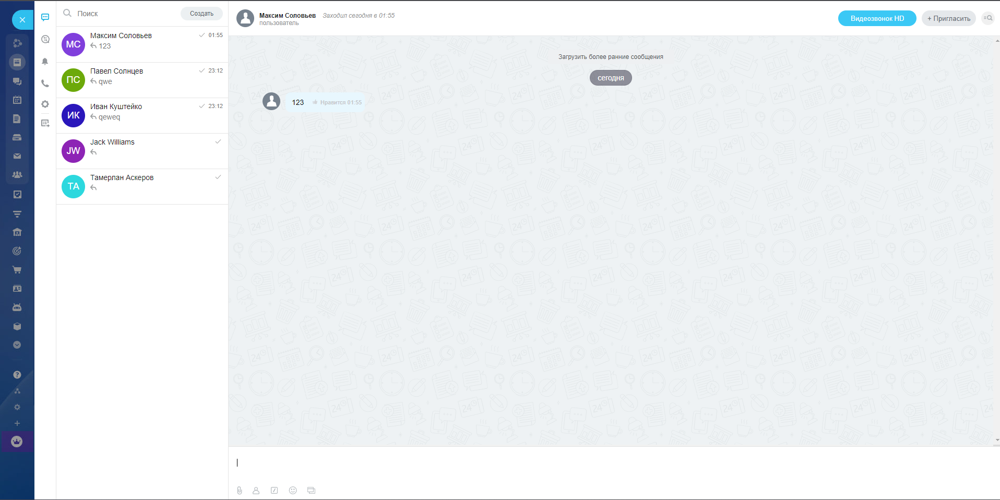

# [Bitrix Chat](https://bitrix-vue3.netlify.app/)
[](https://app.netlify.com/sites/bitrix-vue3/deploys)

Выполнение задания, верстки макета чата на Bitrix, 
в котором реализован простой функционал 
отправки сообщений.


## Технологии 
Vue3 \
TailWindCSS


### Для запуска проекта:

Важно иметь Node Packet Manager последней стабильной версии

```
npm install
```

### dev

```
npm run serve
```

### build

```
npm run build
```

### lint

```
npm run lint
```
Приложение будет запущено на порту 8080